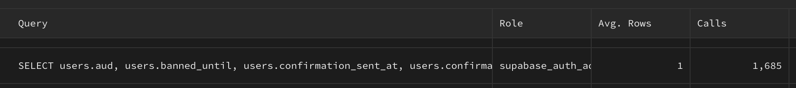

# supabase-safesession

A secure tool designed for server-side user session management in applications using Supabase.

## Glossary

### Background

The default Supabase auth client lacks optimal compatibility with server components, leading to potential security risks and performance issues.

### Database Overload

Using Supabase's `auth.getUser()` method in server components triggers a unique backend request each time, potentially resulting in a large number of database queries. This can significantly slow down your system. Below is a screenshot from a Supabase dashboard showing the frequency of queries for a single user with minimal server components:



### Security Concerns

The typical approach of using `getUser` once in middleware and then relying on `getSession` is problematic. The `getUser` method validates a JWT based solely on its format and expiry, not its authenticity, accepting any correctly formatted JWT as valid.

## Alternative Approach

`supabase-safesession` utilizes `jsonwebtoken` to securely verify sessions without unnecessary database queries, focusing primarily on user ID to manage user-related data efficiently. It also handles expired tokens, leveraging Supabase to refresh tokens and update cookies accordingly.

## Quick Start

### Configuration

1. Retrieve your JWT secret from the Supabase project settings (API tab) and add it to your `.env` file.

### Setup

2. Install the package:

```bash
npm i supabase-safesession
```

3. Create a Supabase server client and initialize `AuthManager`:

```typescript
import { createServerClient, type CookieOptions } from "@supabase/ssr";
import { cookies } from "next/headers";
import { AuthManager } from "supabase-safesession";

export function createSupabaseServerClient() {
  const cookieStore = cookies();

  return createServerClient(
    process.env.NEXT_PUBLIC_SUPABASE_URL!,
    process.env.NEXT_PUBLIC_SUPABASE_ANON_KEY!,
    {
      cookies: {
        get(name: string) {
          return cookieStore.get(name)?.value;
        },
        set(name: string, value: string, options: CookieOptions) {
          try {
            cookieStore.set({ name, value, ...options });
          } catch (error) {
            console.error("Error setting cookie in server component:", error);
          }
        },
        remove(name: string, options: CookieOptions) {
          try {
            cookieStore.delete({ name, ...options });
          } catch (error) {
            console.error("Error removing cookie in server component:", error);
          }
        },
      },
    }
  );
}
// Export the initialized Supabase client and AuthManager
export const supabaseServerClient = () => createSupabaseServerClient();
export const supabaseServerAuth = () =>
  new AuthManager(supabaseServerClient(), process.env.SUPABASE_JWT_SECRET!);
```

4. use `AuthManager` inside your server components:

```typescript
export default async function ExampleComponent() {
  const {
    data: session,
    status,
    error,
  } = await supabaseServerAuth.getSafeSession();

  // Implement component logic using the session data
  return <div>User session status: {status}</div>;
}
```
